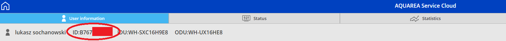

# Aquarea2mqtt
Wrapper for Panasonic Aquarea Service Cloud to MQTT for a smart home integration like Home-Assistant (or for some machine learning)


Configuration 
rename config.example to config

values: 

```
AquareaServiceCloudURL="https://aquarea-service.panasonic.com/" < base URL for aquarea Service Cloud 
AquareaSmartCloudURL="https://aquarea-smart.panasonic.com/" < base URL for aquarea Smart Cloud
AquareaServiceCloudLogin="" < Aquarea Service Cloud login !!! it's not the same like for a smart cloud!!
AquareaServiceCloudPassword="" < Aquarea Service Cloud password !!! it's not the same like for a smart cloud!!
AquateaTimeout=4 < timeout to wait for a aquarea response in seconds
MqttServer="" 
MqttPort="1883"
MqttLogin="test"
MqttPass="testpass"
MqttClientID="aquarea-test-pub"
MqttKeepalive=60  < in seconds 
PoolInterval=2 < in seconds 
LogSecOffset=2550 <number of seconds for searching last statistic information from aqwuarea service cloud
```


published topics :

	EnduserID                         string
	RunningStatus                     string
	WorkingMode                       string
	WaterInleet                       string
	WaterOutleet                      string
	Zone1ActualTemperature            string
	Zone1SetpointTemperature          string
	Zone1WaterTemperature             string
	Zone2ActualTemperature            string
	Zone2SetpointTemperature          string
	Zone2WaterTemperature             string
	DailyWaterTankActualTemperature   string
	DailyWaterTankSetpointTemperature string
	BufferTankTemperature             string
	OutdoorTemperature                string
	CompressorStatus                  string
	WaterFlow                         string
	PumpSpeed                         string
	HeatDirection                     string
	RoomHeaterStatus                  string
	DailyWaterHeaterStatus            string
	DefrostStatus                     string
	SolarStatus                       string
	SolarTemperature                  string
	BiMode                            string
	ErrorStatus                       string
	CompressorFrequency               string
	Runtime                           string
	RunCount                          string
	RoomHeaterPerformance             string
	RoomHeaterRunTime                 string
	DailyWaterHeaterRunTime           string
  
  
  
  
  you should know you'r device ID from aquarea service cloud
  
  
  
  home assistant config examples:
  
  ```

  climate:
  - platform: mqtt
    name: HeatPumpSetpoint
    initial: 0
    min_temp: -5
    max_temp: 5
    modes:
      - "auto"
    current_temperature_topic: "aquarea/state/B76<REST OF DEVICE ID>/Zone1SetpointTemperature"
    temperature_command_topic: "aquarea/B76<REST OF DEVICE ID>/Zone1SetpointTemperature/set"
    precision: 1.0
	
binary_sensor:
   - platform: mqtt
    name: "HeatPump DefrostStatus"
    state_topic: "aquarea/state/B76<REST OF DEVICE ID>/DefrostStatus"
	
sensor:
  - platform: mqtt
    name: "HeatPump Zone1WaterTemperature"
    unit_of_measurement: '°C'
    state_topic: "aquarea/state/B76<REST OF DEVICE ID>/Zone1WaterTemperature"
```


TODO:


	- Test on ServiceCloud  with more than one heatpump
	
	- test with heatpump equiped with option board etc
	
	- add auto download of dictionary in TranslateCodeToString
	
	- general code optymalization and cleaning
	
	- writing some other parameters (tank temperature etc) 
	
